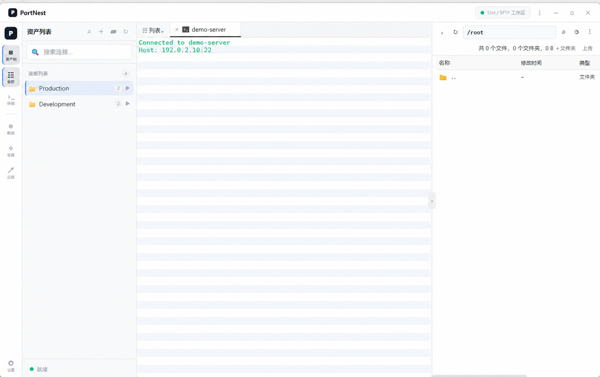

# PortNest

PortNest 是一款面向运维、开发和远程管理场景的本地优先 SSH / SFTP 桌面工作区。它将会话资产树、多标签终端和远程文件管理集中在一个窗口中，减少在多个工具之间来回切换。

当前版本专注于 SSH 与 SFTP；数据库、容器和其他连接类型仍在后续规划中。

[下载最新版本](https://github.com/biyuzhuang/PortNest/releases/latest) · [查看 Releases](https://github.com/biyuzhuang/PortNest/releases)

## 产品界面



> 截图来自 PortNest 界面，连接名称和地址已替换为演示数据；`192.0.2.10` 属于文档示例保留地址，不对应真实服务器。

## 核心功能

### SSH 终端

- 多标签 SSH 会话，可在资产列表和已打开终端之间快速切换
- 支持密码、私钥和带口令私钥认证
- 支持终端主题、字体、字号、行高、背景和缓存行数设置
- 支持鼠标选中自动复制、右键粘贴和 `Ctrl+V` 粘贴
- SSH keepalive、断线识别和可选自动重连
- 串行输出读取和输入队列，降低高延迟或大量粘贴时的会话卡顿风险

### SFTP 文件管理

- SSH 终端与远程文件列表同屏使用
- 浏览远程目录，并显示文件类型、大小、修改时间、权限和用户/组
- 上传、下载、新建目录、删除和重命名
- 显示隐藏文件、路径联动和显示列配置
- 文件面板支持展开、收起和拖动调整宽度
- SFTP 使用独立 SSH 连接，避免文件操作阻塞终端会话

### 资产与会话管理

- 使用文件夹和多级嵌套文件夹组织连接
- 会话可在根目录、不同文件夹之间拖动
- 文件夹与会话支持拖动排序，顺序持久化保存
- 文件夹显示自身及所有子文件夹的会话总数
- 按终端、数据库、容器和远程桌面类型筛选资产
- 支持搜索、右键菜单、批量选择和批量删除
- 资产大列表支持 TCP 延迟检测、刷新和延迟列显示切换

### 桌面体验与更新

- Windows 原生安装程序，可选择安装目录并创建桌面快捷方式
- 支持签名的应用内更新
- 设置与连接数据保存在本地
- 敏感凭据采用本地加密存储

## 安装

前往 [GitHub Releases](https://github.com/biyuzhuang/PortNest/releases/latest) 下载：

```text
PortNest_<version>_x64-setup.exe
```

运行安装程序后可自定义安装目录。Windows WebView2 Runtime 缺失时，安装程序会按配置处理运行环境。

## 本地开发

### 环境要求

- Windows 10/11
- Node.js 18 或更高版本
- Rust stable 与 Cargo
- Microsoft WebView2 Runtime
- Tauri 2 所需的 Windows C++ 构建工具

### 启动开发环境

```powershell
git clone https://github.com/biyuzhuang/PortNest.git
cd PortNest
npm install
npm run tauri:dev
```

只启动前端页面：

```powershell
npm run dev
```

### 构建前端

```powershell
npm run build
```

### 构建 Windows 安装程序

自动更新产物需要 Tauri 签名私钥。私钥必须仅保存在本地，不能提交到 Git。

```powershell
$env:CARGO_BUILD_JOBS="2"
$env:TAURI_SIGNING_PRIVATE_KEY_PATH=(Resolve-Path "src-tauri\.keys\portnest.key").Path
npm run tauri:build
```

构建结果位于：

```text
src-tauri/target/release/bundle/nsis/
```

## 技术栈

- [Tauri 2](https://tauri.app/)：桌面应用外壳与原生能力
- [SolidJS](https://www.solidjs.com/)：前端界面
- [TypeScript](https://www.typescriptlang.org/)：前端开发语言
- [xterm.js](https://xtermjs.org/)：终端渲染
- Rust `ssh2`：SSH 与 SFTP
- SQLite：本地连接、文件夹和设置数据

## 安全说明

- 不要把私钥、密码、真实服务器地址或包含敏感终端输出的截图提交到仓库。
- `src-tauri/.keys/` 中的更新签名私钥必须离线备份并保持私密。
- 首次连接的 SSH 主机密钥会记录在本地；如果主机密钥发生变化，应用会拒绝连接并提示风险。
- 发布截图应使用演示数据或在提交前完成脱敏。

## Roadmap

- 继续完善 SSH 隧道、代理和高级认证
- 增强大文件传输、传输队列与断点续传
- 完善终端会话恢复和诊断日志
- 后续评估数据库、容器和远程桌面连接能力

## 反馈

欢迎通过 [GitHub Issues](https://github.com/biyuzhuang/PortNest/issues) 提交问题和功能建议。请在日志或截图中隐藏 IP、用户名、主机名、路径和凭据信息。
